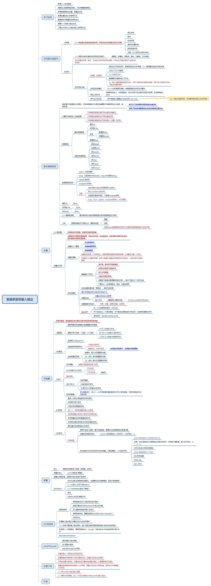

# 数据类型的输入输出

## 思维导图

## 思维导图需要补充的内容

### 整形int

整形规定了`整数`的`表现形式`，整数的`运算（操作）`，以及整数在计算机中的`表示范围`

* 整形数的内部表示：二进制补码
* 整形数的表示范围：取决于二进制的位数

整形类型标识符：`int`

* 类型修饰符：`long,short,signed,unsigned`
* C++规定

`char <= short int <= int <= long int`

在32位编译器中  
`short int`、signed short int、unsigned short int  
有符号短整型占用两个字节存储空间  
有符号长整型占用了四个字节存储空间  

有符号整数和无符号整数的不一样
有符号整数的最高位是符号位：**0表示正数，1表示负数。对于16位整数：表示范围：**

> 负数：-32768~-1  
> 1000000000000000~1111111111111111  
> 正数：0~ 32767  
> 0000000000000000~0111111111111111

整数溢出 Sample

    #include<iostream>
    using namespace std;

    int main(){
        short a,b;
        a=32767;
        b=a+1;
        cout<<"a="<<a<<endl<<"b="<<b<<endl;
        cout<<sizeof(short)<<endl;
        return 0;
    }

### 字符型char

* 字符类型用于表示ACSII编码字符，在32位系统中字符型数据占1字节。
* 它有三种不同的类型
  * char 1字节
  * signed char 1字节
  * unsigned char 1字节
* 系统表示字符型数据时，不是将字符本身的形状存入内存，而是将字符的ASCII码存入内存。
* 在ANSI/ISO C++中，还有另一种字符类型wchar_t，表示双字节编码字符，称为宽字符。

### 布尔类型bool

* 用于表示逻辑量的`真`和`假`，因此也成为`逻辑类型`。
  * 0代表false，1代表true
  * 占1字节的存储空间
* 注意：任何数值都可自动换成bool值
  * 0可被转换成false
  * `任何不等于0`的数值都被转换成true

### 实型

* 实型又称`浮点型`，是用来表示具有小数点的`实数`
  * 数值以规范化的二进制数指数形式存放。
  * 浮点型，用于表示实型的类型有float（单精度）、double（双精度）和long double（长双精度）
  * float(4B) double(8B) long double(10B)

float 存储格式

### 字面量

字面量

    #include<iostream>
    using namespace std;
    int main() {
        cout<<123<<" "<<0123<<" "<<-0123
            <<" "<<0x15<<" "<< -0x15
            <<" "<<0x123<<" "<<-0x123<<endl;
        return 0;
    }

### 枚举

枚举

    #include<iostream>
    using namespace std;
    int main() 
    {
    //enum Color{
    //RED,BLUE,GREEN,WHITE,BLACK
    //};
        enum Color{
            RED=100,BLUE=200,GREEN,WHITE=300
        };
        Color paint=BLUE;
        cout<<paint<<endl;
        cout<<GREEN;
        
    }

    // 通过建立枚举类型定义枚举符
    // 枚举类型：是用户自定义类型，属于构造类型，需要列出该数据类型的取值范围。
    // 创建枚举类型的格式。

    // 枚举类型中列出的枚举符称为枚举常量，它是和整数一一对应的符号 

### 常量

    #include<iostream>
    using namespace std;

    const double PI=3.1415926; // PI是一个常量 
    int main(){
        double r=100.0,area;
        area=PI*r*r; // 引用PI
        cout<<"圆的面积是："<<area<<"\n";
        return 0; // 指定返回值 
    }

### define和const的区别

    #include<iostream>
    #include<stdio.h>
    using namespace std;

    #define PI 3.1416
    #define AREA(R) PI*R*R
    #define CUBE(X) ((X)*(X)*(X))

    double Area(double r){
        double t;
        const double pi=3.1416;
        t=pi*r*r;
        return t;
    } 

    double Cube(double s){
        double q;
        q=s*s*s;
        return q;
    }

    int main(){
        int a=AREA(3);
        cout<<"AREA(R)="<<AREA(3+3)<<endl;  // 换成3+3如何?
        cout<<"Area(r)="<<Area(3+3)<<endl;
        
        int height=100;
        cout<<"CUBE(s)"<<CUBE(height++)<<endl;
        cout<<"height="<<height<<endl; 
        height=10;
        cout<<"Cubes(s)"<<Cube(height++)<<endl;
        cout<<"height="<<height<<endl;
        return 0;
    }

### IO流常用的控制符

控制符  
dec 设基数为10  
hex 设基数为16  
oct 设基数为8  
setfill(c) 设填充字符为c  
setprecision(n) 设显示小数精度为n位  
setw(n)  设域宽为n个字符  
setiosflags(ios::fixed)  固定的浮点显示  
setiosflags(ios::scientific)  指数表示  
setiosflags(ios::left)  左对齐
setiosflags(ios::right)  右对齐  
setiosflags(ios::skipws)  忽略前导空白  
setiosflags(ios::uppercase)  十六进制大学输出  

* setprecision(n)
  * n控制显示的数字位数（系统默认：有效位6位）
  * 说明
    * 在用浮点表示的输出时，n表示有效位数（系统默认6位，不包括小数点）
    * 在用定点表示的输出时：n表示小数位数
    * 在用指数形式输出时，n表示小数位数
    * 小数位数截短显示时，进行四舍五入处理。
* setw(n) 设置值的输出宽度
  * 说明:仅仅对`下一个数值的输出生效`，如果实际位数>n，按照实际宽度输出

输出八进制和十六进制数

    #include<iostream>
    using namespace std;
    int main(){
        int number=1001;
        cout<<"Decimal:"<<dec<<number<<endl;
        cout<<"Hexadecimal:"<<hex<<number<<endl;
        cout<<"Octal:"<<oct<<number<<endl;
    } 

设置填充字符 ！921考题

    #include<iostream>
    #include<iomanip> // 要用到格式控制符
    using namespace std; 

    int main(){
        cout<<setfill('*')<<setw(2)<<21<<endl<<setw(3)<<21<<endl<<setw(4)<<21<<endl;
        cout<<setfill(' ');
    }

左右对齐输出

    #include<iostream>
    #include<iomanip> // 要用到格式控制符
    using namespace std;

    int main() {
        cout<<setw(10)<<15<<endl; // s
        cout<<setiosflags(ios::right)
            <<setw(5)<<1
            <<setw(5)<<2
            <<setw(5)<<3<<endl;
        cout<<resetiosflags(ios::right)<<setiosflags(ios::left) // 如果再设置
            <<setw(5)<<1
            <<setw(5)<<2
            <<setw(5)<<3<<endl;
        cout<<left
            <<setw(5)<<1
            <<setw(5)<<2
            <<setw(5)<<3<<endl;
    }

强制显示小数点和符号  

    #include< iostream >  
    #include< iomanip > // 要用到格式控制符
    using namespace std;
    int main() {
        cout <<10.0/5 <<endl;  //2
        cout <<setiosflags(ios::showpoint)
            <<10.0/5 <<endl;  //2.00000

        cout <<10 <<"  "<<-20 <<endl; //10 -20
        cout <<setiosflags(ios::showpos)
            <<10 <<"  "<<-20 <<endl; //+10 -20
    }

## 本章小结

* 关键字是C++预先定义好的标识符
* 变量是程序分配给某个内存位置的名字，变量必须先定义后使用
* 不同的变量名不能同名，变量名应该尽量反映变量的用途，以增强程序的可读性
* 常量在数据类型前用关键字const声明，变量必须先定义并赋初值，程序执行中常量值不可改变
* C++用cout和cin输出输入数据
* C++兼容c的库函数，在C++中也可以使用printf和scanf作为输出输入
