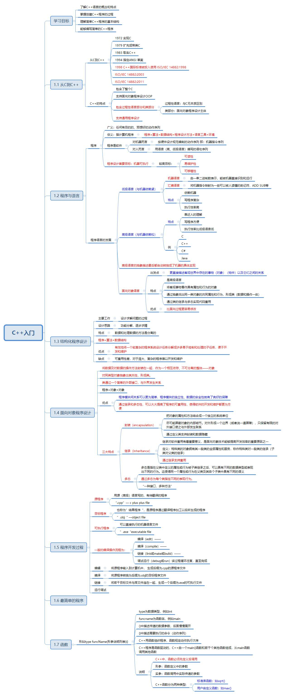

# C++入门

* [C\+\+入门](#c%E5%85%A5%E9%97%A8)
  * [思维导图](#%E6%80%9D%E7%BB%B4%E5%AF%BC%E5%9B%BE)
  * [思维导图需要补充的内容](#%E6%80%9D%E7%BB%B4%E5%AF%BC%E5%9B%BE%E9%9C%80%E8%A6%81%E8%A1%A5%E5%85%85%E7%9A%84%E5%86%85%E5%AE%B9)
    * [简单的程序](#%E7%AE%80%E5%8D%95%E7%9A%84%E7%A8%8B%E5%BA%8F)
    * [函数](#%E5%87%BD%E6%95%B0)
    * [补充：头文件包含](#%E8%A1%A5%E5%85%85%E5%A4%B4%E6%96%87%E4%BB%B6%E5%8C%85%E5%90%AB)
    * [补充：程序书写规范](#%E8%A1%A5%E5%85%85%E7%A8%8B%E5%BA%8F%E4%B9%A6%E5%86%99%E8%A7%84%E8%8C%83)
    * [本章小结](#%E6%9C%AC%E7%AB%A0%E5%B0%8F%E7%BB%93)

## 思维导图

## 思维导图需要补充的内容

### 简单的程序

***

**1.6** 简单的程序1

**C++程序** 由 **注释**、**预编译处理**、**程序主体**组成。

区分大小写，abc与ABC不同。

C++语句以**分号**(;)结束，一行可以写**多条语句**，一条语句可以分**写多行**。

注释：插入到程序中的说明

单行注释：//

多行注释：/* */

    // HelloWorld.cpp 第一个程序
    /*
        该程序的功能是输出 HelloWorld 

    */ 

    // 单行注释

    // 注释的目的是增加程序可读性，计算机不会执行注释中的语句 

    #include<iostream>
    // include：编译预处理命令，文件包含

    // iostream.h 是C++为了特定环境编制的标准输入/输出流的标注头文件
    // 也就是说，这个头文件提供了输入/输出设施。

    // int main() 主函数，程序的入口，一个C++程序，有且只能有一个main函数。main是函数名
    // int 表示整数（integer）数据类型，位于main前面，表示main函数应该返回一个整数值

    // 一个花括号{...} 是表示main的函数体 

    using namespace std;
    
    int main(){
        cout<<"Hello,World"<<endl;
        return 0;
    } 

说明：

* `cout`是标准输出设备的名称，`<<`是插入运算符，指示将后边的数据送到显示器设备上去。
* `...`：表示字符串常量，原样输出。
* `\n`：控制字符，表示换行操作，控制字符是`\`和另一个字符的组合
* `return`是函数的返回语句，执行到此时函数返回。其后的语句将不再执行。

***

**1.6** 简单的程序 2

    #include<iostream>
    using namespace std;

    int main(){
        int a,b,result; // 定义变量
        cout<<"please input two numbers:\n"; // 显示提示信息
        cin>>a>>b; // 输入变量的值
        result=3*a-2*b+1;
        cout<<"result is "<<result<<endl; // 输出结果
        return 0; // 指定返回值 
    }

说明：

* 所有的对象（变量）必须先定义，或先声明、后使用。
* `=` 赋值符号
* `cout<<result`输出变量的值，连续使用几个`<<`可以连续输出多个值
* endl相当于`\n`表示换行 

***

### 函数

形如

    type funcName(形参说明列表){...}

为一个函数定义的描述，其中

* type为数据类型，例如int
* funcname为函数名，例如main
* ()中描述传递的数据参数，后面慢慢展开
* {}中描述需要执行的命令

例如代码如下

    #include<iostream> 
    #include<math.h>
    using namespace std;

    int main(){
        double a,b,c;
        cout<<"input two numbers:"<<endl;
        cin>>a>>b;
        c=max(a,b);
        cout<<"the squart of maximum="<<sqrt(c);
        return 0;
    }

    double max(double x,double y){
        if(x>y)
            return x;
        else
            return y;
    }

### 补充：头文件包含

* #include的预编指令，称为预处理指令
* iostream.h是C++编译器自带的文件，称为C++库文件
* 头文件包含两种格式
  * 标准方式：用尖括号括起来，由编译系统提供的并放在指定的子文件中。
  * 用户方式：用双引号括起来，放在用户当前工作文件夹中的指定文件夹中，通常是用户自己编写的。
* 以".h"为扩展名，C语言
* 为了使iostream中的定义对程序有效，还需使用下面的名称空间编译指令来指定：

> using namespace std;  
> `std`是"名空间"，避免名称冲突

    #include<iostream>
    using namespace std;

### 补充：程序书写规范

* 对齐原则
* 缩进原则
* 分段原则
* 统一原则

### 本章小结

* 程序设计语言的发展历程，C++的特点。
* C++编程操作流程。
* 简单的C++程序结构
* 过程化程序设计和面向对象程序设计的基本思想
