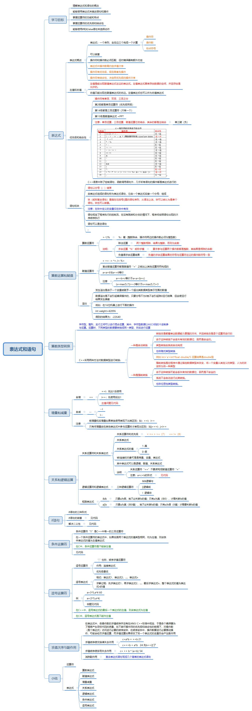

# 表达式与语句

## 思维导图

## 思维导图补充内容

### 自增左值问题

    #include<iostream> 
    #include<math.h>
    using namespace std;

    int main(){
        int a=5;
        ++(++a); 
        // ++(a++); 
        cout<<a<<endl;
        
        // 增量左值问题 
        
        // 由于 前增量 操作返回的值即 修改之后的变量值，所以返回的仍然是一个左值
        // 由于 后增量 操作返回的值是 原先a的值，而后a的值已经发生变化，故返回的不能是当前a，
        // 只能是过去的a值，不能是左值。 
        return 0;
    }

### 关系和逻辑运算 a < c < b的形式

    #include<iostream> 
    #include<math.h>
    using namespace std;

    int main(){
        int a=1,b=2,c=11113; 
        cout<<(a<c<b)<<endl;
        // 永真
        // a和c比 值是 1，b只要大于1永真 
        return 0;
    }

### if的二义性

    #include<iostream> 
    #include<math.h>
    using namespace std;

    int main(){
        int x;
        int y=0;
        cout<<"Enter x";
        cin>>x;
        if(x>=0)
            if(x>0)
                y=1;
            else
                y=-1;
        cout<<y<<endl;
    }

### 条件运算符左值问题

    #include<iostream> 
    #include<math.h>
    using namespace std;

    int main(){
        // 在一个条件运算符的表达式中，如果后边两个表达式值类型相同，均为左值
        // 则该条件运算符表达式的值为左值表达式 
        int x=5;
        long a,b;
        (x?a:b)=1; // ok 因为左右都是左值
        //(x?x:a)=2; // error x和a不是一个类型。 编译器将其理解为(long)x和a 
        //(x==a?1:a)=3; // error:1不能是左值 
        cout<<a;
    }

### 逗号表达式和三目运算符的混合运算

    #include<iostream> 
    #include<math.h>
    using namespace std;

    int main(){
        int a=4;
        a=a*5,a*4,a=4?a/4:++a;
        cout<<a;
    }

### 逗号表达式左值问题

### 求值次序交换律失效问题
